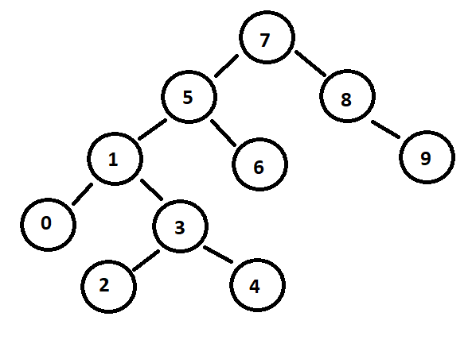

# BINARY SEARCH TREE PROJESÝ

www.patika.dev

## [7, 5, 1, 8, 3, 6, 0, 9, 4, 2] dizisinin Binary-Search-Tree aþamalarýný yazýnýz.

- dizinin sýralý olup olmadýðý bilinmediðinden root 7 kabul edilirse
- 5: 7'den küçük olduðu için solunda bulunur
- 1: 5'ten küçük olduðu için solunda bulunur
- 8: 7'den büyük olduðu için saðýnda bulunur
- 3: 1'den büyük olduðu için saðýnda bulunur
- 6: 5'ten büyük olduðu içib saðýnda bulunur
- 0: 1'den küçük olduðu için solunda bulunur
- 9: 8'den büyük olduðu için saðýnda bulunur
- 4: 3'ten büyük olduðu için saðýnda bulunur
- 2: 3'ten küçük olduðu için solunda bulunur

